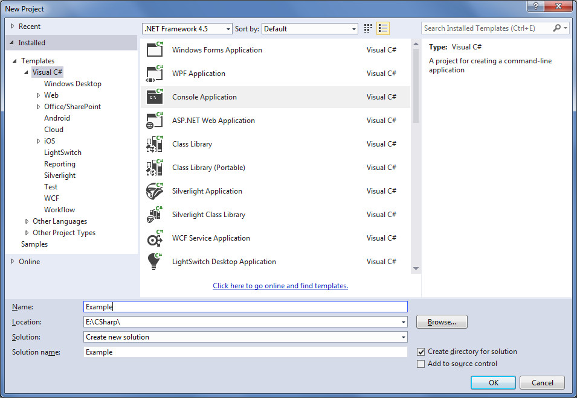
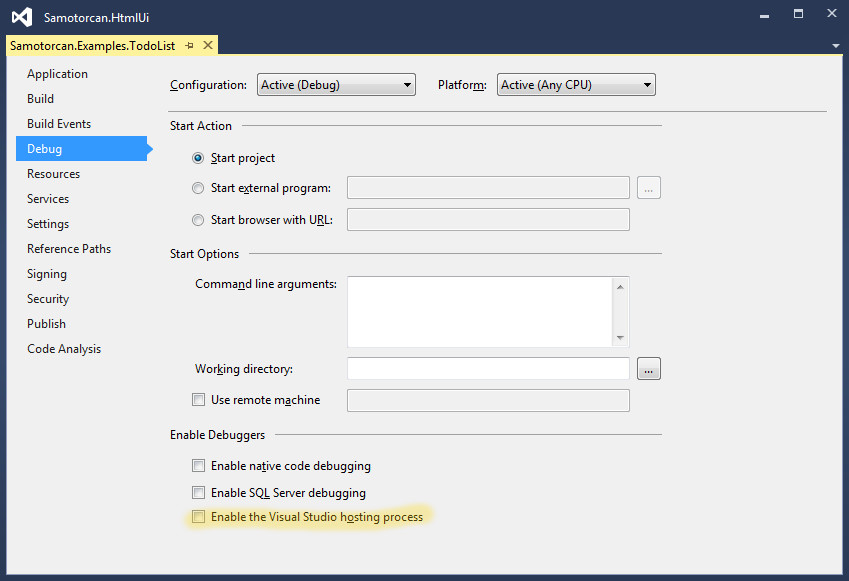
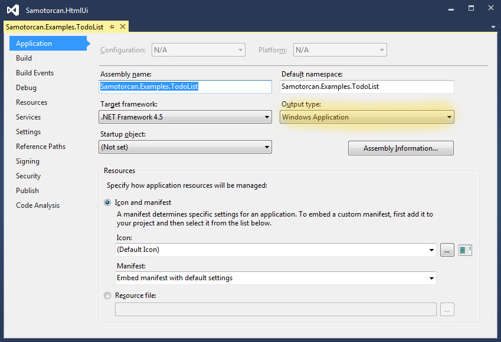
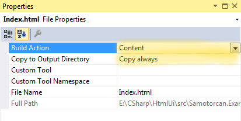

# HtmlUi
HtmlUi is a framework for creating desktop C# applications with HTML user interface.

## Overview
The framework uses [CEF](https://bitbucket.org/chromiumembedded/cef) library to render the UI and C# to connect controllers with the UI. For client side on the UI the framework curently only support [AngularJS](https://angularjs.org/). Every AngularJS controller is linked with the C# controller and so every property changed in the C# controller gets updated to the AngularJS controller and vice versa. Methods on the C# controller are also linked to to the AngularJS side so they can be called from the UI.

## CEF binaries
CEF binaries can be compiled from the [CEF sources](https://bitbucket.org/chromiumembedded/cef/wiki/BranchesAndBuilding) or downloaded from the [CEF Builds](https://cefbuilds.com/). HtmlUi currently uses CEF version 3.2272.2035. The required files for CEF to run are listed [here](https://code.google.com/p/chromiumembedded/source/browse/trunk/cef3/tools/distrib/win/README.redistrib.txt). The repository also includes the Windows x86 binaries to run examples without the need to search and download the right CEF.

## CefGlue
To use CEF in C# the framework uses a library called [CefGlue](https://bitbucket.org/xilium/xilium.cefglue) to P/Invoke calls to CEF. Which CEF version the framework uses is conditional with the CefGlue library. When the CefGlue library gets updated so will the framework be upadated to use the newest CEF version.

## Usage
The framework was only tested with Visual Studio 2013.

To create a new application first create a new Console Application in Visual Studio. The minimum C# supported version by the framework is 4.5.



To debug the application with CEF 'Enable the Visual Studio hosting process' must be unchecked in the project properties. If this is enabled you will only get a white screen when running the application in debug mode.



Next the output type in project options must be changed to Windows Application so the console window is not started.



The framework uses [log4net](http://logging.apache.org/log4net/) to write logs. The example configuration for log4net is:
```XML
<log4net>
  <appender name="GeneralLog" type="log4net.Appender.RollingFileAppender">
    <file value="Logs/general.log"/>
    <appendToFile value="true"/>
    <lockingModel type="log4net.Appender.FileAppender+InterProcessLock"/>
    <rollingStyle value="Size"/>
    <maxSizeRollBackups value="5"/>
    <maximumFileSize value="5MB"/>
    <staticLogFileName value="true"/>
    <layout type="log4net.Layout.PatternLayout">
      <conversionPattern value="%date [%property{pid}-%thread] %level - %message%newline"/>
    </layout>
  </appender>
  <root>
    <level value="DEBUG"/>
    <appender-ref ref="GeneralLog"/>
  </root>
</log4net>
```
The important part is to use InterProcessLock so the logs can be written from all the CEF processes.

The framework will start multiple processes where the first started process will be the main application process. To correctly run child processes the main method of the application should look like something like this:
```C#
static void Main(string[] args)
{
    if (HtmlUiRuntime.ApplicationType == ApplicationType.MainApplication)
        RunMainApplication();
    else
        RunChildApplication();
}

private static void RunMainApplication()
{
    using (var application = new MainApplication())
    {
        application.Run();
    }
}

private static void RunChildApplication()
{
    using (var application = new ChildApplication())
    {
        application.Run();
    }
}
```
At this part the HtmlUi must be added in references to correctly find HtmlUi classes.

The framework currently supports only one main window. To add the view for the main window create a folder named Views and add Index.html file. This file will contain the html for the UI part. Next you have to mark the Index.html file as Embedded Resource or Copy always in the file properties.



From here on now you can start the application and you should get an empty white window. To edit the UI simply add all your html in the Index.html and rerun the application. If you selected that Index.html is Copy always you can edit the file and refresh (F5) the window without restarting the application. The Developer Tools can be accessed by pressing F12 or clicking the top left corner of the application and selecting Developer Tools.

To connect a C# controller with the AngularJS controller create an angular module and include the `htmlUi` module. Next in the AngularJS controller request a service `htmlUi.controller` and create the C# controller with `htmlUiController.createObservableController('controllerName', $scope);`. Now the `$scope` will contain all the properties and methods that are defined in the C# controller.

```JavaScript
var app = angular.module('myApp', ['htmlUi']);

app.controller('exampleController', ['$scope', 'htmlUi.controller', function ($scope, htmlUiController) {
    htmlUiController.createObservableController('exampleController', $scope);
    
    // controller code ...
});
```

To create a C# controller simply create a class that extends either Controller or ObservableController. The controllers that are extended from Controller will only have methods linked to the AngularJS controller and properties will be ignored. Controllers created this way are used where the AngularJS scope is not created like services.

```C#
public class ExampleController : Controller
{
    public void DoSomething()
    {
        // this method can be called from JavaScript
    }
}
```

Controllers that extend ObservableController are used where the AngularJS scope is created like the AngularJS controller. The scope will contain all the methods and the properties that are defined in the C# controller. The properties are also linked and every property changed in scope or C# controller will be sync back. In AngularJS the framework adds watches to all the controller properties to watch for changes and sync them back to C# controller. In C# controller the framework must be notified of property changes by calling the `INotifyPropertyChanged.PropertyChanged` event or `SetField` in Controller.

```C#
public class ExampleController : Controller
{
    public string SomeProperty { get; set; }    // only changes from JavaScript to C# are synced
    
    private string _someOtherProperty;
    public string SomeOtherProperty             // changes are synced both ways
    {
        get { return _someOtherProperty; }
        set { SetField(ref _someOtherProperty, value); }
    }
}
```

## Examples
The sources contain one example application [TodoList](src/Samotorcan.Examples.TodoList). The application shows how to use the HtmlUi framework to sync todo items from UI to C# and load and save todo items in a JSON file.


